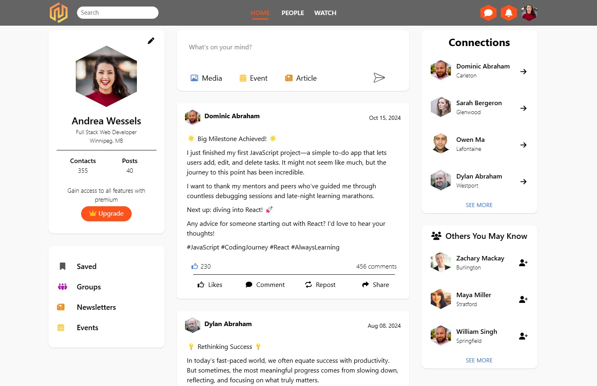

# HiveMind
## Overview
HiveMind is a group project to make an example of a workplace based social web app. We built it using css and html best practices, and populated it with the randomUser API.

## Authors

- [@dave-sommerville](https://github.com/dave-sommerville) (Dave Sommerville)
- [@mr-reutcky](https://github.com/mr-reutcky) (Samuel Reutcky)
- [@myles-reid](https://github.com/myles-reid) (Myles Reid)

## Features
- User Authentication: Users can log in with a username and password
- Username: testUser
- Password: testPass
- Remember Me: Option to stay logged in across sessions (holding test username)
- Forgot Password: Functionality to recover a forgotten password.
- Profile Picture: Display of the user's profile image
- Contacts: Number of user connections.
- Suggestions: Recommendations for other users to connect with.
- Upgrade Prompt: Option to gain access to all features with a premium account.
- User Posts: Users can share experiences and allows for likes and comments 
- Display: Showcase of user connections.
### Languages Used 

### Preview

Photo by <a href="https://unsplash.com/@michaeldam?utm_content=creditCopyText&utm_medium=referral&utm_source=unsplash">Michael Dam</a> on <a href="https://unsplash.com/photos/closeup-photography-of-woman-smiling-mEZ3PoFGs_k?utm_content=creditCopyText&utm_medium=referral&utm_source=unsplash">Unsplash</a>
      
